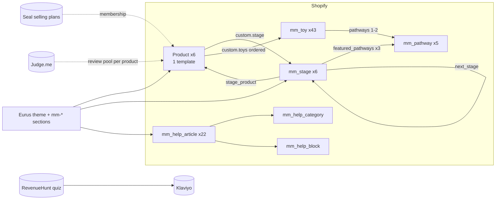

# 00 Implementation overview: Mini Minds Co Shopify website

**Status:** implementation specification, ready for build planning. No theme code exists yet.
**Theme:** Eurus (Shopify Online Store 2.0), Swirl preset, plus bespoke Mini Minds sections and snippets.
**Data model:** `3-data-model/Mini_Minds_Shopify_Data_Model_v2.6.xlsx` (approved, see `CHANGELOG_v2.6.md`).

| Document | Covers |
|---|---|
| [01_PAGE_TEMPLATE_MAP](01_PAGE_TEMPLATE_MAP.md) | Every route, template and section in page order |
| [02_COMPONENT_AND_SECTION_SPEC](02_COMPONENT_AND_SECTION_SPEC.md) | The authoritative inventory of bespoke sections, snippets and app blocks |
| [03_COMMERCE_AND_SUBSCRIPTION_RULES](03_COMMERCE_AND_SUBSCRIPTION_RULES.md) | Purchase routes, Seal, basket, WELCOME10, gifting |
| [04_DATA_AND_INTEGRATION_CONTRACTS](04_DATA_AND_INTEGRATION_CONTRACTS.md) | How the theme and apps consume v2.6 and exchange data |
| [05_INTERACTION_AND_RESPONSIVE_SPEC](05_INTERACTION_AND_RESPONSIVE_SPEC.md) | Behaviour, states, accessibility, breakpoints |
| [06_ASSET_IMPLEMENTATION_MAP](06_ASSET_IMPLEMENTATION_MAP.md) | Assets per template and their Shopify destination |
| [07_IMPLEMENTATION_OPEN_ITEMS](07_IMPLEMENTATION_OPEN_ITEMS.md) | **The single register of everything unresolved** |
| [HANDOFF_CONTEXT](HANDOFF_CONTEXT.md) | Short master context for new sessions |

---

## 1. Purpose and build approach

Mini Minds Co sells **six stage-matched developmental toy bundles** covering the first year (0–12 months), each with a printed Parent Guide. Customers can buy once, subscribe for the remaining stages (one bundle every 2 months), or prepay three consecutive stages.

The build approach is **theme-led**:
1. Configure native Eurus/Swirl sections wherever the approved design can be met by settings.
2. Build bespoke `mm-*` sections and snippets only where the design needs data-driven, stateful or non-native behaviour.
3. Use apps for the functions they own: subscriptions (Seal), reviews (Judge.me), quiz (RevenueHunt) and email (Klaviyo).
4. Keep customer-facing copy merchant-editable (section settings or metaobjects). Never hard-code copy in Liquid (rule SEC-01).

## 2. Source-of-truth hierarchy

When two sources disagree, the higher source wins. **A contradiction is recorded in [07](07_IMPLEMENTATION_OPEN_ITEMS.md), never silently resolved.**

| Rank | Source | Authority over |
|---|---|---|
| 1 | Owner decisions recorded in the v2.6 workbook, its CHANGELOG, and these docs | Business rules |
| 2 | **Root-level Claude Design project** "Mini Minds Co Site Wireframe" (`*.dc.html`, root `README.md`) | Visual design, UX, copy, interactions |
| 3 | **`3-data-model/Mini_Minds_Shopify_Data_Model_v2.6.xlsx`** | Structured data: metaobjects, fields, seed data, rules |
| 4 | Root handoff pages: Pre-Developer Handoff, Eurus Build Handoff, Custom Sections Spec, Image Asset Handoff, Component Library, Test Plan | Supporting detail only; superseded where they conflict with 1–3 |
| 5 | `3-data-model/source-v2.5/`, Claude Design `uploads/` (older register, policy .docx, PDP copy sheets) | Historical reference only |
| — | Claude Design `archive/` | **Historical only. Never build from it.** |

Known stale spots in rank 2–4 sources that these docs override:
- The README stage-tint line.
- The prototype's `?dob=` URL hand-off.
- The Custom Sections Spec's quiz-CTA placement.
- The obsolete drawer file `Basket.dc.html`.

Each is listed in [07 §10](07_IMPLEMENTATION_OPEN_ITEMS.md#10-design-clean-up-and-design-gaps-des).

## 3. Shopify / Eurus architecture

- **One reusable Product template** (`templates/product.bundle.json`) serves **all six bundle URLs**. Everything stage-specific is read through `product.metafields.custom.stage` (→ `mm_stage`) and `product.metafields.custom.toys` (→ ordered `mm_toy` list). Product carries **no other custom metafields** (see [04 §2](04_DATA_AND_INTEGRATION_CONTRACTS.md#2-products-and-the-stage-graph)).
- **Product handles (fixed):** `new-beginnings`, `awakening-senses`, `little-explorer`, `mover-and-shaker`, `curious-climber`, `independent-explorer`.
- **Metaobjects (6 types):** `mm_stage`, `mm_pathway`, `mm_toy`, `mm_help_category`, `mm_help_article` (renderable web page), `mm_help_block`.
- **Purchase eligibility** comes from Seal selling-plan membership, not metafields (see [03](03_COMMERCE_AND_SUBSCRIPTION_RULES.md)).

## 4. Customer-facing sitemap

| Area | Route (Shopify) | Template |
|---|---|---|
| Home | `/` | `index` |
| Shop Bundles | `/collections/bundles` (proposed handle) | `collection.bundles` |
| Bundle ×6 | `/products/{handle}` | `product.bundle` (one template) |
| Find My Bundle | `/pages/find-my-bundle` | `page.finder` |
| Play Snapshot Quiz | `/pages/quiz` (route **OPEN R5**) | `page.quiz` |
| How It Works | `/pages/how-it-works` | `page.how-it-works` |
| Why Mini Minds | `/pages/why-mini-minds` | `page.why` |
| About | `/pages/about` | `page.about` |
| Basket | `/cart` | `cart` |
| Checkout | Shopify-hosted | Checkout settings (branding only) |
| Account | Shopify customer accounts + Seal portal | Shopify-hosted (see S6) |
| Help Centre hub | `/pages/help` | `page.help` |
| Help article ×22 | `/pages/help/{handle}` (**to verify S4**) | `metaobject/mm_help_article` |
| Contact | `/pages/contact` | `page.contact` |
| Track My Order | `/pages/track-my-order` | `page.track` |
| Search | `/search` | `search` |
| Get 10% Off | `/pages/get-10-off` | `page.offer` |
| Policies | `/policies/privacy-policy`, `/policies/terms-of-service`; `/pages/delivery`, `/pages/returns`, `/pages/cookie-policy`, `/pages/accessibility` | Shopify policies + `page.policy` |
| 404 | any unknown path | `404` |

Page handles other than the six product handles are **proposals** that the developer should confirm at build. They are not decided business values.

## 5. Reusable template strategy

| Template | Reused by | Driven by |
|---|---|---|
| `product.bundle` | Six bundles | `custom.stage`, `custom.toys`, Seal selling plans, Judge.me |
| `page.policy` | Four policy pages | Page content + `mm-policy-anchors` |
| `metaobject/mm_help_article` | 22 Help articles | `mm_help_article` + blocks |
| Shared sections | Several pages (`mm-stage-timeline`, `mm-five-pathways`, `mm-play-pause-progress`, `mm-parent-guide`, `mm-quiz-cta`, `mm-bundle-grid`) | One Liquid file each, with variants set in section settings |

## 6. Major systems and apps

| System | Owns | Status |
|---|---|---|
| Shopify | Products, price (£72.99), cart, checkout, customer accounts, native search, order status/tracking, policies, discounts | Confirmed |
| **Seal Subscriptions** | Subscribe-every-2-months and Prepay-3 selling plans, stage progression (product swaps), charges, reminders, dunning, customer subscription portal | Confirmed app; behaviour **to verify** (SE1–SE10) |
| **Judge.me** (Awesome plan) | Six per-product review pools, review requests, widgets | Confirmed; SE/J items open |
| **RevenueHunt** | Five-question Play Snapshot Quiz and its result | Confirmed; R1–R5 open |
| **Klaviyo** | Marketing consent, WELCOME10 delivery, three flows (welcome, recovery, post-purchase) | Confirmed; K1–K6 open |
| Consent platform | Cookie banner and preferences | **Not yet chosen** (C-01) |
| Shopify-native tracking | Order status | Confirmed; Track123 is the fallback only after a failed parcel test |

"One sender per event" rule: Klaviyo sends marketing; Shopify sends receipts, refunds, dispatch and delivery emails; Seal sends subscription charge, failure and next-bundle notices; Judge.me sends review requests. The journey-complete message is **not** a Seal feature (see [03 §9](03_COMMERCE_AND_SUBSCRIPTION_RULES.md#9-stage-6-and-journey-completion)).

## 7. Theme-native vs bespoke (summary)

The full list is in [02](02_COMPONENT_AND_SECTION_SPEC.md).

- **Native Eurus (configure):** announcement bar, desktop header and menu, desktop footer, rich text, image-with-text, multicolumn, collapsible FAQ, contact form base, search base, cart base, 404, policy pages.
- **Bespoke (`mm-*`):**
  - mobile header and footer
  - homepage hero with pathway rotator
  - stage grid with pricing toggle
  - subscription panel
  - finder
  - product buy box and plan selector
  - product gallery
  - stage education, bundle contents, journey
  - Help hub and article
  - contact form enhancements
  - search enhancements
  - the shared developmental sections (timeline, pathways, Play/Pause/Progress, Parent Guide)
  - cart plan label and plan change
  - policy anchors
  - reveal and motion utilities
- **App blocks:** Seal (portal and, if required, widget), Judge.me widgets, RevenueHunt embed, Klaviyo form.

Whether each "native" item is actually achievable with Eurus/Swirl settings must be confirmed against the installed theme (**S9**). If it isn't, it becomes bespoke.

## 8. Implementation principles

1. **One canonical object per concept:** stage = `mm_stage`, toy = `mm_toy`, pathway = `mm_pathway`. Derive rather than duplicate. Never create `custom.pathways`, `custom.next_stage_product`, `custom.age_range`, a toy-count field or eligibility metafields.
2. **Presentation only for app state.** The theme reads selling plans and app data; it never computes fulfilment or charges (SUB-01).
3. **No exact date of birth leaves the Finder's browser session** (DATA-01, [04 §7](04_DATA_AND_INTEGRATION_CONTRACTS.md#7-finder-and-quiz-data-flow)).
4. **Merchant-editable copy** (SEC-01). Metaobjects hold stage, toy, pathway and Help data; section settings hold everything else.
5. **Accessibility target WCAG 2.2 AA:**
   - 44 px minimum targets.
   - Visible focus ring `0 0 0 4px rgba(161,131,255,.35)`.
   - Reduced motion respected.
   - Meaning never carried by colour or icon alone.
   - Make no conformance claim until audited.
6. **Consent first:** nothing non-essential loads before consent. Accept and Reject have equal weight.
7. **Motion:** fades and small translate/scale only, 120–360 ms. Every auto-animation has a pause control or is static under reduced motion.
8. **UK English, sentence case.** Brand tokens are mapped to Eurus colour schemes and settings ([05 §1](05_INTERACTION_AND_RESPONSIVE_SPEC.md#1-design-tokens-and-breakpoints)).

## 9. Confirmed business rules (index)

| Rule | Where specified |
|---|---|
| Prices: one-time **£72.99** (no compare-at); Subscribe **£68.99** per bundle; Prepay 3 **£195.99** ("Save £22.98" / "Save over 10%", never an exact "10% off") | [03 §2](03_COMMERCE_AND_SUBSCRIPTION_RULES.md) |
| Eligibility: Subscribe on bundles 1–5; Prepay 3 on bundles 1–4; stage 6 is one-time only | 03 §3 |
| WELCOME10: first subscription bundle **£65.69** (10% off the £72.99 one-time price, which must be stated); then £68.99; subscription first order only | 03 §5 |
| Subscription progresses one stage per paid bundle and ends after Independent Explorer. No pause or skip; no resume or re-base (SUB-04) | 03 §8 |
| Prepay 3 is an upfront purchase of three deliveries with no ordinary self-service cancellation | 03 §10 |
| Free standard UK delivery on every parcel; 3–5 business days; UK mainland + Northern Ireland | 03 §7 |
| Gifts: recipient email (optional) and message (≤200 characters) captured on the product page; printed gift insert; no verification claim | 03 §6 |
| Finder: exact age at arrival (today + 5 days); bump if fewer than 14 days of the stage remain at arrival (19 days from today); 12+ months → out-of-range screen | [04 §7](04_DATA_AND_INTEGRATION_CONTRACTS.md) |
| Quiz: month-level only; stored as `YYYY-MM`; no day-level bump | 04 §7 |
| Exact DOB never persisted or transmitted (DATA-01) | 04 §7 |
| Reviews: Judge.me only; module hidden while empty; never invented ratings | 02, 04 §10 |
| "Help Centre" is the only name for the help destination | 01 |
| No due dates collected anywhere | 04 §7 |

## 10. Unresolved items

Everything unresolved lives in **[07_IMPLEMENTATION_OPEN_ITEMS.md](07_IMPLEMENTATION_OPEN_ITEMS.md)**, grouped as:
- Shopify (S)
- Seal (SE)
- RevenueHunt (R)
- Klaviyo (K)
- Judge.me (J)
- Legal (L)
- Content (VAL / CNT)
- Assets (AST)
- Consent and analytics (C)
- Design clean-up and gaps (DES)

The ones that most affect implementation sequencing:
- **S3:** Help metaobjects in search.
- **S6:** customer-account customisation.
- **S7/SE7:** the £65.69 mechanism.
- **SE1–SE4, SE9, SE10:** Seal eligibility, scheduling, prepay, quantity and selector.
- **S9:** Eurus native capability.
- **C-01:** consent platform.
- **DES-01:** the product-page delivery schedule without DOB.
