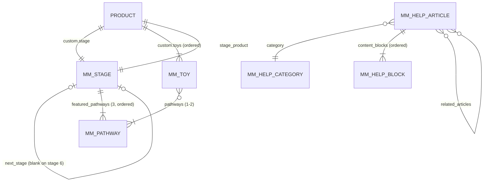
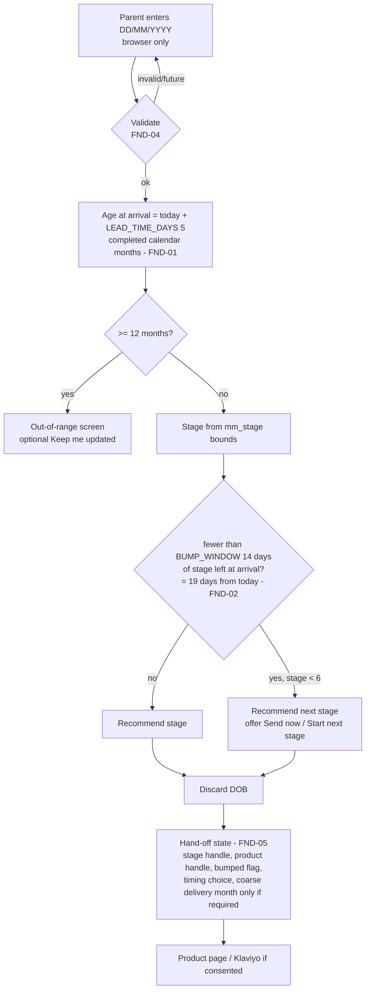
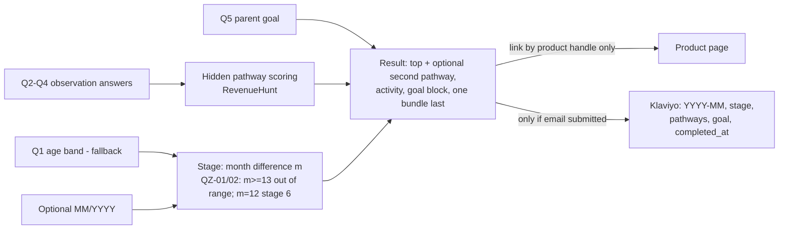

# 04 Data and integration contracts

The schema lives in **v2.6** (`3-data-model/Mini_Minds_Shopify_Data_Model_v2.6.xlsx`). This document does not redefine fields. It explains how the theme and integrations **consume** them.

| Topic | v2.6 sheet |
|---|---|
| Field definitions | 01 |
| Seed data | 02 (stages), 03 (pathways), 04 (toys), 06 / 06b (Help) |
| Klaviyo properties | 07 |
| Line-item properties | 08 |
| Rules | 09 |

---

## 1. Object graph

**Integrity rules** (v2.6 sheet 09):
- **STG-04:** `product.custom.stage` and `stage.stage_product` must agree.
- **STG-06:** `next_stage.stage_order = stage_order + 1`.
- **STG-05:** only stage 6 has a blank `next_stage`.

The theme should **fail soft**: hide a broken link and log it, rather than render a wrong stage.

## 2. Products and the stage graph

| Need | Liquid access | Never |
|---|---|---|
| Stage of this product | `product.metafields.custom.stage.value` → `stage` | — |
| Age label | `stage.age_range_label` | `custom.age_range` |
| Short chip "0–2m" | `{{ stage.age_start }}–{{ stage.age_end }}m` | a stored field |
| Next bundle | `stage.next_stage.value.stage_product.value` | `custom.next_stage_product` |
| Previous bundle | loop `shop.metaobjects.mm_stage.values` for `stage_order == stage.stage_order - 1` | a stored field |
| Toys (ordered) | `product.metafields.custom.toys.value` | re-sorting (TOY-01) |
| Toy count | `product.metafields.custom.toys.value.size` | a count field (TOY-03) |
| Featured pathways | `stage.featured_pathways.value` (3, ordered) | `custom.pathways`, or deriving from toy counts |
| "Also supported" pathways | all `mm_pathway` minus the featured three | — |
| Purchase routes | `product.selling_plan_groups` (Seal) | eligibility metafields (SUB-03) |
| Price | `product.selected_or_first_available_variant.price`; `selling_plan_allocation.price` | literals |

All stage loops sort by `stage_order`; pathway loops sort by `pathway_order`. Verify the reference chain inside app blocks and the account area (**S2**).

## 3. mm_stage, mm_toy and mm_pathway consumption

| Object and fields | Consumed by |
|---|---|
| `mm_stage`: `stage_name`, `age_range_label`, `stage_short_description`, `stage_colour` | `mm-bundle-card`, `mm-bundle-grid`, `mm-stage-timeline`, `mm-stage-chip-rail`, `mm-when-what-how`, finder JSON, search |
| `mm_stage`: `stage_long_description` | `mm-stage-timeline` (How It Works long variant) |
| `mm_stage`: `stage_theme_label`, `pdp_subhead`, `stage_intro`, `noticing_signals`, `stage_wash_colour`, `lifestyle_image(_alt)` | Product page (`mm-product-buy-box`, `mm-stage-education`) |
| `mm_stage`: `guide_cover_image(_alt)`, `guide_spread_image(_alt)` | `mm-product-gallery`, `mm-bundle-contents`, `mm-parent-guide` (product instance) |
| `mm_stage`: `age_start`, `age_end`, `stage_order`, `stage_product` | `mm-finder` JSON island, search age intent |
| `mm_toy`: `name`, `image`, `image_alt`, `what_it_invites`, `pathways` | `mm-bundle-contents`, `mm-product-gallery` |
| `mm_toy`: `supplier*`, `safety_age_marking` | **Never rendered** |
| `mm_pathway`: `name`, `icon_asset`, `colour`, `definition`, `example`, `summary` | `mm-five-pathways` (the product density shows `summary`), toy tags, `mm-when-what-how` |

**Values still pending:** wash colours (VAL-01), featured pathways (VAL-02), stage copy approval (VAL-03), B2 alt text (VAL-04), stage alt texts (VAL-05). The theme must render gracefully while they're empty:
- Hide the "Most active" panel when there are fewer than three featured pathways (PTH-03).
- Fall back to `stage_colour` when there is no wash colour.

## 4. Help Centre metaobjects

- **Hub** (`page.help`): `shop.metaobjects.mm_help_category.values` sorted by `sort_order`. Only categories with at least one **active** article render (HELP-01). Most-read comes from `mm_help_article` where `is_most_read`, sorted by `most_read_order`.
- **Article** (`templates/metaobject/mm_help_article.json`): `metaobject` fields plus `content_blocks.value`, rendered by `block_type`:

  | `block_type` | Renders | Fields |
  |---|---|---|
  | paragraph | `
` | `body` (rich text) |
  | heading | `<h2>` | `heading` |
  | list | `<ul>` if `list_style` is bulleted, `<ol>` if numbered | `list_items` (HELP-04) |
  | note | Labelled note | `heading` (label), `body` |
  | progression | Six stage chips | Generated from `mm_stage` |

- **CTAs:** `cta_label/link` (primary) and `secondary_cta_label/link` (outline). A label always has a link (HELP-03). Routes are pending (VAL-08).
- **Search:** whether metaobject pages are indexed is **S3**. If they aren't, Help articles won't appear in `/search` results; a fallback needs a decision.
- **URL:** `/pages/help/{handle}` (**S4**).

## 5. Klaviyo

Property keys are proposals (**K1**). The retention and format rules are in v2.6 sheet 07.

| Capture point | Consent | Properties written | Notes |
|---|---|---|---|
| Get 10% Off form | Tick **required** on this form (L6) | consent status, `mm_consent_source=get10`, `mm_consent_wording_version`, `mm_welcome_offer_issued(_at)`, `mm_baby_stage` if known | Code emailed (launch mode). States: K6 |
| Finder result email / "Not ready yet" | Optional, unticked; a code is promised **only if ticked** | `mm_baby_stage`, `mm_baby_stage_set_at`, `mm_next_stage_from` (YYYY-MM, reminder only), source `finder` | **No DOB.** L2 |
| Finder / quiz out-of-range "Keep me updated" | Own consent | `mm_future_ranges_interest` | No product promise |
| Quiz email step (RevenueHunt → Klaviyo) | Optional, unticked; result shown either way | `mm_baby_birth_month` (YYYY-MM, only if entered), `mm_baby_stage`, `mm_quiz_primary_pathway`, `mm_quiz_secondary_pathway`, `mm_quiz_parent_goal`, `mm_quiz_completed_at`, source `quiz` | 12-month deletion (R3, K5) |
| Checkout | Shopify's unticked box | Shopify consent synced to Klaviyo (two-way, K3) | |

**Flows at launch:** welcome/discount, basket/checkout recovery, post-purchase. Open tracking is off. There is no soft opt-in.

## 6. Line-item properties

Defined in v2.6 sheet 08.

| Property | Set by | Read by |
|---|---|---|
| `Gift`, `Gift recipient email`, `Gift message` | `mm-gift-fields` (product page, before checkout) | Cart note, order, operations (gift insert), privacy-notice process |
| `_mm_first_delivery` (coarse month/week; **only if SE3 requires it**) | Finder hand-off via the product page | Seal / fulfilment |
| `_mm_source` (`finder` \| `quiz`) | Hand-off | Analytics |
| Seal properties | Seal | `mm-cart-plan-label` (SE8) |

**No property may contain a date of birth.**

## 7. Finder and quiz data flow

### 7.1 Finder

**Rules:**
- **The exact DOB exists only in the Finder page's memory for the current session.**
- It must not be written to URLs, query strings, `pushState`, localStorage/sessionStorage, cookies, analytics events or parameters, Shopify (cart attributes, line properties, notes, customer data), Klaviyo, or RevenueHunt (DATA-01).
- **Hand-off mechanism:** a developer detail. The recommended option is a short-lived sessionStorage record containing **only** the derived state, for example `{stage, product_handle, bumped, timing, delivery_month?}`. Plan preselection may also use a non-DOB URL parameter.
- **Product page consequence:** the prototype's dated delivery schedule ("Your deliveries", computed from DOB) can't be reproduced exactly. It must be derived from the coarse timing state or shown as relative ("Sent now / In 2 months / In 4 months") (**DES-01**).
- **Analytics:** the "DOB match" event from the older analytics list becomes "finder recommendation". Its parameters are the stage and bumped flag only (C-04).

### 7.2 Quiz

- The result is shown without an email ("Skip for now").
- Consent is optional and unticked. Completing the quiz is **not** consent.
- Result links carry the **product handle only**. The prototype puts `dob=YYYY-MM` in the URL. Removing it is **proposed** (DES-03): the birth month isn't an exact DOB, so DATA-01 doesn't strictly cover it, but the product page doesn't need it.
- **Language guardrails** (RevenueHunt copy):
  - Never use "test", "score", "normal", "advanced", "behind" or "on track".
  - Use "Coming through strongly" / "Growing alongside".

## 8. Seal

| Contract | Direction | Status |
|---|---|---|
| Selling-plan groups (Subscribe: products 1–5; Prepay 3: products 1–4) | Seal → Shopify → theme (`selling_plan_groups`) | SE1 |
| Swap sequences and maximum payments per starting stage | Seal configuration | SE2 |
| Line / contract properties for plan labels | Seal → cart | SE8 |
| Customer portal, statuses (ACTIVE / CANCELLED / EXPIRED), cancel reasons | Seal | SE4, SE5 |
| Quantity semantics | Seal | **SE9** |
| Theme-rendered selector compatibility | Seal ↔ theme | **SE10** |

## 9. RevenueHunt

| Output | Destination | Status |
|---|---|---|
| Result page with a product recommendation by handle | Theme page / product page | R4 |
| Profile properties (sheet 07) | Klaviyo (and optionally Shopify customer) | R1 |
| Birth month as YYYY-MM only | Klaviyo | R2 |
| 12-month deletion or anonymisation | RevenueHunt + Klaviyo | R3, K5 |
| Published route or embed | `page.quiz` | R5 |

## 10. Judge.me

| Contract | Detail | Status |
|---|---|---|
| Review pools | One per product (six); no store-wide merge | J1 |
| Display | Product widget; homepage carousel; **hidden while empty**; no invented ratings or counts | J5 |
| Requests | Judge.me owns them. About 14 days after delivery, one reminder. For renewals, the request is for the swapped next-stage product | J2 |
| Labels | Accurate verified-purchase and tester labels | J3 |
| Child media | Two separate unticked consents (site/organic social, paid ads); 12-month licence | L8 |
| Cookies | `jdgm*` in the Functional consent category | C-01 |

## 11. Analytics (consent-gated)

GA4 and Meta Pixel load only after analytics or advertising consent. Proposed events:
- quiz completion
- finder recommendation
- add to basket (with plan)
- subscribe

Event names and parameters are not yet defined (C-04).
- **Confirmed (DATA-01):** no event parameter may contain the exact date of birth.
- **Proposed, pending C-04 / L2:** keep the birth month out of analytics too.
